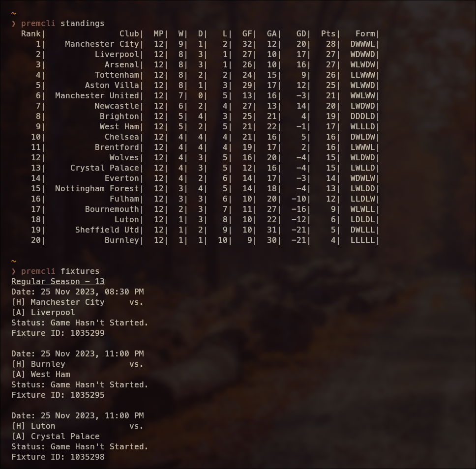
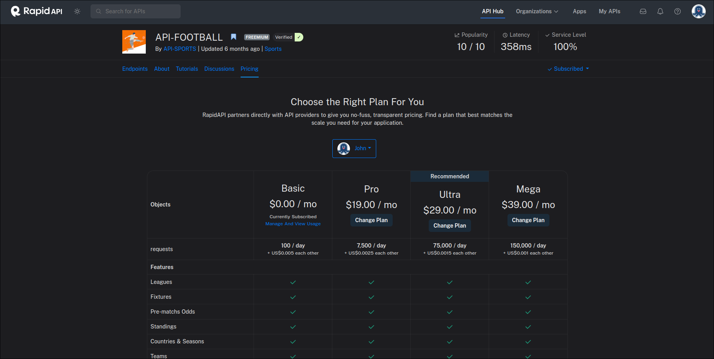

PREMCLI
=======

Premcli is a commandline tool that enables you to track live information related to the premier league. `premcli` requires an API-FOOTBALL api key which can be obtain here:

Features
--------



* Fixtures
* Standings
* Live Events
* Lineups (In development)
* Game Statistics (In development)

Installation
------------

1. Clone this repo:

``` shell
git clone https://github.com/Ay1tsMe/premcli.git
```

2. Build from source:

``` shell
cd premcli

go build -o premcli
```

3. Install to PATH

``` shell
go install
```

Getting Started
---------------

Before you start using `premcli`, you must set up a `premcli.conf` file. To do this, run the following:

``` shell
premcli config
```

You will be prompted to enter your apikey, timezone and favourite team.:

#### API KEY
To obtain an apikey, make a free account on rapidapi.com and subscribe to API-FOOTBALL(https://rapidapi.com/api-sports/api/api-football/)


#### Timezone
The format for your timezone should be like the following:

``` shell
Europe/Berlin
Australia/Sydney
```
If you are unsure what your current timezone is, you can run the following to get a list of available timezones:

``` shell
premcli timezones
```

#### Favourite Team
The format for your favourite team should be the 3 letter acronym that is normally displayed on the scoreboard during a live game. Here are some example:

``` shell
WOL, MCI, CHE
```

Usage
-----
To run, type the `premcli` followed by the command you want to use:

``` shell
premcli [commands] 
```

For help regarding any of the commands, use:

``` shell
premcli [commands] --help
```

#### Fixtures
Displays the current round fixtures.

``` shell
premcli fixtures
```

You can also displays last weeks and next weeks fixture:

``` shell
// Next Weeks Fixture
premcli fixtures --next

// Last Weeks Fixtures
premcli fixtures --previous
```

#### Standings

``` shell
premcli standings
```

#### Live Fixture Event Tracker
Tracks the live events of a fixture given a `fixtureID`

To obtain the `fixtureID`, use `premcli fixtures` to display the fixtures with their appropriate `fixtureID`.

``` shell
premcli live <fixtureID>

premcli live 1035145
```


Planned
-------
Planned features that will be released in the future:
* Lineups
* Game Statistics
* Auto reload live events as an option
* Display all fixtures with -a flag
* Highlight Team with team colour rather than system colours
